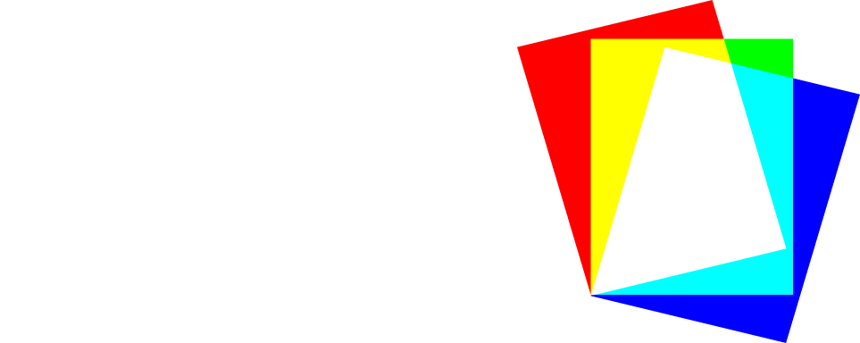

# Overview

**Felt** is a work-in-progress editor for creating and editing trixel-arts - custom asset files in a video game [FEZ](https://store.steampowered.com/app/224760/FEZ/).

Ultimately, Felt will be able to save and load both trile-sets and art objects conveted into `*.fezts.*` and `*.fezao.*` file bundles produced by [FEZRepacker](https://github.com/FEZModding/FEZRepacker), allowing you to seamlessly mod the game by injecting created and edited assets with [HAT Mod Loader](https://github.com/FEZModding/HAT).

# What are trixels?

In the most part, trixels are basically voxels, in that the bigger art pieces are made out of small grid-aligned cubes. However, unlike voxels, trixels can be colored differently on each side, allowing an artist to create more believable pixel-art when trixel-art is being projected onto the screen in the game. This is achieved by using a cubemap projection to color the created model. However, because of this solution, there are two major throwbacks of this format that you have to be aware of:

- trixel faces behind and in front of other trixel faces will always have the same color,
- triles and art objects always need to have an uniform size, otherwise cubemap could not be constructed.

This is a limitation of a format/game and not this software. In the future, this could potentially be changed by adding new projection system that a special HAT modification could support.

FEZ distinguishes two types of trixel-arts: **triles** and **art objects**.

**Triles** are meant to be stored in trile-sets, and used to build a bigger map by arranging them in a trile grid (same thing as tile grid, but in 3D), while **art objects** are additional decoration models, which aren't limited by the grid arrangement or size.

# Roadmap

- [X] Orbital camera control with ortographic mode for easy preview of each face
- [X] Optimized generation of the trile mesh
- [X] Tools for appending/removing regions of trixels with
- [X] Tools for painting cubemaps on top of triles
- [ ] Trile properties configuration (name, size, actor type)
- [ ] Manipulation of trixel regions (selection, moving, rotating, flipping, copy-pasting)
- [ ] Saving and loading trilesets and art objects with appended trixel data
- [ ] Importing trilesets and art objects by generating trixel data from mesh
- [ ] Gallery of triles (for trile sets) and switching between them
- [ ] Different preview modes (wireframe, flat, shaded)
- [ ] Helper construction tools (like mirror mode)
